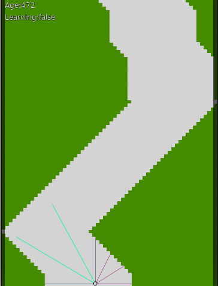

## Learning to stay on road with reinforcement learning

Possible actions: 0 - step left, 1 - stay, 2 - step right

State: Range from the side of the road in angles -90°, -60°, -30°, 0°, 30°, 60°, 90°

Environemnt: The road ahead

Drawing: [p5](https://p5js.org/)

Neural net: [convnetjs](http://cs.stanford.edu/people/karpathy/convnetjs/)

